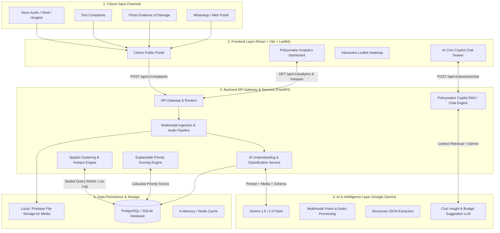

# CivicPulse AI — System Architecture Specification

## 1. Executive Summary
**CivicPulse AI** is an AI-powered Civic Demand Intelligence Platform designed for urban governance (e.g., Indore Municipal Corporation / Swachh Indore). It solves the problem of fragmented, unstructured citizen complaints across multiple channels (voice, messaging, photos, text) by converting them into structured, geo-tagged intelligence, identifying demand hotspots on interactive maps, calculating explainable priority scores, and giving policymakers an AI-driven decision portal.

---

## 2. High-Level System Architecture Diagram

---

## 3. Component Breakdown

### 3.1 Frontend Web Application (React + Tailwind CSS + Lucide)
- **Framework**: Vite + React 18+ (SPA for ultra-low latency & responsive UX).
- **Styling**: Tailwind CSS with sleek modern municipal styling (emerald/slate/indigo palette, glassmorphism cards, responsive dark/light modes).
- **Key Modules**:
  1. **Citizen Portal (`/report`)**:
     - Voice recorder with live audio wave visualizer.
     - Media photo uploader with instant preview.
     - Dual-mode input: Speak in Hindi/English or type.
     - Geolocation auto-detection with fallback ward dropdown for Indore.
     - Instant AI feedback toast with extracted category & ticket tracking ID.
  2. **Admin Command Center (`/admin`)**:
     - **Metric Overview Bar**: Total Reports, Active Hotspots, Critical Urgency Index, Resolution Rate.
     - **Interactive Leaflet Map View (`/admin/map`)**:
       - Multi-layer toggle: Raw Markers vs. Density Heatmap (`leaflet.heat`) vs. Ward Polygon Outlines.
       - Marker clustering with severity-coded pins (Red = Critical, Amber = Moderate, Blue = Low).
       - Clicking a hotspot pops up aggregated stats (number of reports, top category, priority score).
     - **Demand Hotspots & Priority Queue (`/admin/priorities`)**:
       - Ranked list of issues sorted by **Explainable Priority Score (0–100)**.
       - Breakdown modal displaying why the score was given.
     - **Pattern & Trend Analytics (`/admin/analytics`)**:
       - Category distribution (Water Supply, Potholes/Roads, Waste Management, Streetlights, Drainage).
       - Time-series breakdown showing day-over-day surge in issues.
     - **AI Policymaker Assistant Drawer (`/admin/copilot`)**:
       - Chat assistant grounded in current live database complaints.
       - Quick action prompt chips: *"What are the top 3 road hazards in Vijay Nagar?"*, *"Draft a resource deployment notice for Ward 15"*.

---

### 3.2 Backend Services (FastAPI + Python 3.10+)
- **Framework**: FastAPI (Async, Pydantic v2 validation, auto OpenAPI / Swagger documentation at `/docs`).
- **Core Endpoints**:
  - `POST /api/v1/complaints/submit`: Handles multipart form data (audio recording / image / text / user phone / coordinates).
  - `GET /api/v1/complaints`: Lists paginated complaints with filters (ward, status, category, severity).
  - `GET /api/v1/hotspots`: Runs spatial aggregation and returns clustered hotspots with boundary hulls and heat intensities.
  - `GET /api/v1/analytics/summary`: Returns pre-computed KPIs, ward breakdown, and category breakdown.
  - `POST /api/v1/assistant/chat`: Accepts policymaker queries, retrieves relevant ward context, and calls Gemini for analytical responses.
  - `PATCH /api/v1/complaints/{id}/status`: Updates ticket status (`Reported` $\rightarrow$ `Under Review` $\rightarrow$ `Work Scheduled` $\rightarrow$ `Resolved`).

---

### 3.3 AI Processing Pipeline (Google Gemini)
- **Model**: `gemini-1.5-flash` or `gemini-2.0-flash` for high throughput, low latency, and native multimodal support.
- **Functions**:
  1. **Multimodal Ingestion**: Accepts raw citizen voice notes (`.webm`, `.mp3`, `.wav`) and images (`.jpg`, `.png`).
  2. **Zero-Shot Classification**: Categorizes complaint into standardized municipal taxonomy.
  3. **Entity & Location Extraction**: Identifies landmark mentions (e.g., *"Chhappan Dukan ke paas", "Vijay Nagar Square"*), severity signals, and sentiment.
  4. **Explainability Justification**: Generates 1-sentence rationale for the calculated severity score.

---

### 3.4 Data & Spatial Engine
- **Primary Database**: SQLite (default local development, zero setup) with seamless connection string upgrade to PostgreSQL / Neon.
- **ORM**: SQLAlchemy 2.0 (Async) + Alembic migrations.
- **Spatial Strategy**: Grid-based spatial binning & Haversine distance clustering for clustering individual points into ward-level Demand Hotspots without needing heavyweight PostGIS setup for the hackathon demo.

---

## 4. Security & Configuration
- **API Security**: Environment-based configuration via `.env` (`GEMINI_API_KEY`, `DATABASE_URL`, `CORS_ORIGINS`).
- **Data Privacy**: Citizen phone numbers can be masked in the admin view to protect privacy while preserving geographical analytics.
