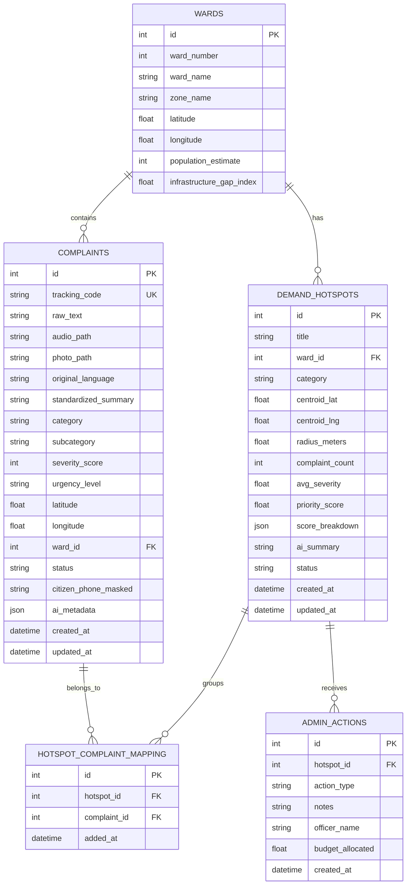

# CivicPulse AI — Database Schema Specification

## 1. Overview
The database layer captures citizen complaints, tracks AI-extracted metadata, aggregates spatial clusters into **Demand Hotspots**, stores explainable priority scores, and logs administrative actions.

---

## 2. Entity Relationship Diagram (ERD)

---

## 3. Table Definitions & Column Details

### 3.1 Table: `wards`
Stores predefined municipal administrative divisions (pre-seeded with major Indore wards: Palasia, Vijay Nagar, Rajwada, Bhanwar Kuan, Sudama Nagar, etc.).

| Column | Type | Constraints | Description |
| :--- | :--- | :--- | :--- |
| `id` | INTEGER | PRIMARY KEY, AUTOINCREMENT | Unique ID |
| `ward_number` | INTEGER | NOT NULL, UNIQUE | Official municipal ward number (1–85) |
| `ward_name` | VARCHAR(100) | NOT NULL | Name of the ward / area |
| `zone_name` | VARCHAR(100) | NOT NULL | Municipal Zone (e.g. Zone 3, Zone 7) |
| `latitude` | FLOAT | NOT NULL | Center coordinate latitude |
| `longitude` | FLOAT | NOT NULL | Center coordinate longitude |
| `population_estimate` | INTEGER | DEFAULT 35000 | Estimated resident/footfall count |
| `infra_gap_index` | FLOAT | DEFAULT 0.5 | Baseline infrastructure deficiency (0.0 to 1.0) |

---

### 3.2 Table: `complaints`
Stores individual raw and AI-processed citizen reports.

| Column | Type | Constraints | Description |
| :--- | :--- | :--- | :--- |
| `id` | INTEGER | PRIMARY KEY, AUTOINCREMENT | Internal complaint ID |
| `tracking_code` | VARCHAR(32) | NOT NULL, UNIQUE | Public tracking code (e.g., `CP-IND-4091`) |
| `raw_text` | TEXT | NULLABLE | Original citizen text input |
| `audio_path` | VARCHAR(255) | NULLABLE | Path/URL to recorded audio note |
| `photo_path` | VARCHAR(255) | NULLABLE | Path/URL to uploaded evidence image |
| `original_language` | VARCHAR(30) | DEFAULT 'Hindi/English' | Detected language (e.g., Hindi, Hinglish, English) |
| `standardized_summary` | TEXT | NOT NULL | AI-generated clear English summary |
| `category` | VARCHAR(60) | NOT NULL | Category (e.g., `Roads & Potholes`, `Water Supply`, `Sanitation & Waste`) |
| `subcategory` | VARCHAR(100) | NULLABLE | Specific subcategory (e.g., `Open Manhole`, `Garbage Overflow`) |
| `severity_score` | INTEGER | NOT NULL | 1 (Minor) to 5 (Critical/Hazard) |
| `urgency_level` | VARCHAR(20) | DEFAULT 'Medium' | `Low`, `Medium`, `High`, `Emergency` |
| `latitude` | FLOAT | NOT NULL | GPS latitude |
| `longitude` | FLOAT | NOT NULL | GPS longitude |
| `ward_id` | INTEGER | FOREIGN KEY (`wards.id`) | Mapped municipal ward |
| `status` | VARCHAR(30) | DEFAULT 'Reported' | `Reported`, `Under Review`, `Work Scheduled`, `Resolved` |
| `citizen_phone_masked` | VARCHAR(20) | NULLABLE | Masked for privacy (e.g. `+91 98****1234`) |
| `ai_metadata` | JSON | NULLABLE | Key entities, detected landmarks, sentiment, confidence |
| `created_at` | DATETIME | DEFAULT CURRENT_TIMESTAMP | Submission timestamp |
| `updated_at` | DATETIME | DEFAULT CURRENT_TIMESTAMP | Last updated timestamp |

---

### 3.3 Table: `demand_hotspots`
Aggregated spatial clusters representing chronic or emerging civic demand hotspots.

| Column | Type | Constraints | Description |
| :--- | :--- | :--- | :--- |
| `id` | INTEGER | PRIMARY KEY, AUTOINCREMENT | Hotspot ID |
| `title` | VARCHAR(150) | NOT NULL | Generated title (e.g. *"Recurring Drainage Hazard near Palasia Square"*) |
| `ward_id` | INTEGER | FOREIGN KEY (`wards.id`) | Primary ward |
| `category` | VARCHAR(60) | NOT NULL | Primary category of the cluster |
| `centroid_lat` | FLOAT | NOT NULL | Geographic center latitude of the cluster |
| `centroid_lng` | FLOAT | NOT NULL | Geographic center longitude of the cluster |
| `radius_meters` | FLOAT | DEFAULT 200.0 | Span of the cluster |
| `complaint_count` | INTEGER | NOT NULL | Total reports merged into this hotspot |
| `avg_severity` | FLOAT | NOT NULL | Mean severity score of constituent complaints |
| `priority_score` | FLOAT | NOT NULL | **Explainable Composite Score (0.0 to 100.0)** |
| `score_breakdown` | JSON | NOT NULL | JSON dictionary: volume, severity, duration, population, infra points |
| `ai_summary` | TEXT | NOT NULL | Executive summary with proposed civic recommendation |
| `status` | VARCHAR(30) | DEFAULT 'Active' | `Active`, `Under Intervention`, `Resolved` |
| `created_at` | DATETIME | DEFAULT CURRENT_TIMESTAMP | First detected |
| `updated_at` | DATETIME | DEFAULT CURRENT_TIMESTAMP | Last recalculated |

---

### 3.4 Table: `admin_actions`
Audit trail of decisions and resource allocations made by municipal officials.

| Column | Type | Constraints | Description |
| :--- | :--- | :--- | :--- |
| `id` | INTEGER | PRIMARY KEY, AUTOINCREMENT | Action ID |
| `hotspot_id` | INTEGER | FOREIGN KEY (`demand_hotspots.id`) | Targeted hotspot |
| `action_type` | VARCHAR(50) | NOT NULL | `INSPECTION_ORDERED`, `BUDGET_ALLOCATED`, `CONTRACTOR_ASSIGNED`, `RESOLVED` |
| `notes` | TEXT | NULLABLE | Officer justification notes |
| `officer_name` | VARCHAR(100) | DEFAULT 'Municipal Officer' | Name or role of acting official |
| `budget_allocated` | FLOAT | DEFAULT 0.0 | Estimated or assigned repair budget (in INR) |
| `created_at` | DATETIME | DEFAULT CURRENT_TIMESTAMP | Action timestamp |
